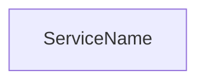

# Teach Codebase Feature

## Quick Start

Given a commit range or feature description, produce a self-contained HTML lesson with clickable Mermaid diagrams that open VS Code at exact lines.

## Workflow

### 1. Research (parallel agents)

Launch 3 agents simultaneously:

- **Backend** — services, controllers, domain logic, data models, error handling
- **Frontend** — components, state management, hooks, routing, UI patterns
- **Infrastructure** — gateway config, docker, env vars, CI, test strategy

Each agent should read files fully and report: classes, methods, connections, patterns.

### 2. Find Line Numbers

Launch an agent to grep exact line numbers for every class/method/function that will appear in diagrams. Format: `FILE:LINE - description`. This is critical — without it, links are useless.

### 3. Build Lesson HTML

Create `lessons/NNNN-feature-name.html` with diagrams covering:

| Diagram | Type | Purpose |
|---------|------|---------|
| System architecture | `flowchart TB` | Full stack layer view |
| State machine | `stateDiagram-v2` | Entity lifecycle |
| Sequence per flow | `sequenceDiagram` | Request/mutation paths |
| Class diagram | `classDiagram` | Class relationships and interfaces |
| Component tree | `flowchart TB` | UI hierarchy |
| Error flow | `flowchart LR` | Exception → response mapping |
| Security layers | `flowchart TB` | Defence in depth |

### 4. Make Diagrams Clickable

**Two approaches** — use the right one per diagram type:

#### Flowcharts (native click)



Requires `securityLevel: 'loose'` in mermaid config.

#### Sequence Diagrams AND Class Diagrams (JSON mapping + script)

Never use Mermaid `link` directive — it creates a popup menu. Instead, place a JSON mapping block after the diagram:

```html
<pre class="mermaid">
sequenceDiagram
    participant AMS as ActivityManagementService
    AMS->>GH: POST /git/blobs
</pre>
<script type="application/json" class="diagram-links">
{
  "ActivityManagementService": "vscode://file/C:/path/Service.cs:49",
  "POST /git/blobs": "vscode://file/C:/path/Client.cs:130"
}
</script>
```

For class diagrams — same approach, map class names AND method names:

```html
<pre class="mermaid">
classDiagram
    direction TB
    namespace Domain {
        class MyService {
            +DoWork() Result
        }
    }
</pre>
<script type="application/json" class="diagram-links">
{
  "MyService": "vscode://file/C:/path/MyService.cs:10",
  "DoWork": "vscode://file/C:/path/MyService.cs:25"
}
</script>
```

The `diagram-links.js` asset handles rendering these as direct single-click links. It also attaches click handlers to parent `<g>` elements so clicking anywhere on a class box (not just the text) navigates to code.

## Key Rules

- **`classDiagram` syntax** — avoid `?` in return types (write `CachedMapping` not `CachedMapping?`), avoid freetext lines (no `TTL: 1 hour` inside class bodies), avoid `{curly}` in strings. Use `&lt;&lt;interface&gt;&gt;` for stereotypes in HTML context.
- **`classDiagram` layout** — use `namespace` blocks to group related classes (Controllers, Domain, Ports, Adapters). Use `direction LR` when there are many classes — it lays out namespaces horizontally giving each class more vertical space for readable text. Order relationships to follow the same direction to minimize line crossings.
- **`classDiagram` clicks** — use JSON mapping approach (same as sequences). Map EVERY method and property shown in the diagram, not just class names. The script matches by substring so if a method is in the SVG text but not in the JSON, it won't be clickable. Audit the diagram definition and ensure every single line inside every class body has a corresponding JSON key.
- **Never `link` in sequences** — creates popup. Use JSON mapping approach.
- **Map actions too** — not just participants. "POST /pulls" should link to the method that calls it.
- **Participant aliases = class names** — so JSON mapping matches both the alias and the rendered text.
- **Always test** — create a minimal `test-click.html` with debug logging, verify clicks work, then delete it.
- **Include `source-links` divs** — below sequence diagrams as fallback navigation.

## Mermaid Config

```js
mermaid.initialize({
  startOnLoad: true,
  securityLevel: 'loose',
  theme: 'base',
  themeVariables: { fontSize: '18px', /* ... */ },
  sequence: { useMaxWidth: true, wrap: true, showSequenceNumbers: true },
  flowchart: { useMaxWidth: true, htmlLabels: true, curve: 'basis' },
  state: { useMaxWidth: true },
});
```

## Assets

Ensure these exist in `./assets/` (create from [REFERENCE.md](REFERENCE.md) if missing):

| File | Purpose |
|------|---------|
| `lesson-style.css` | Shared Tufte-inspired stylesheet, 1400px max-width |
| `diagram-links.js` | Post-render click handler for sequence diagrams |
| `sequence-player.js` | Optional animated step-through for text-based sequences |

## HTML Skeleton

```html
<!DOCTYPE html>
<html lang="en">
<head>
  <meta charset="UTF-8">
  <link rel="stylesheet" href="../assets/lesson-style.css">
  <style>
    body { max-width: 1400px; }
    .mermaid { background: white; border: 1px solid #ddd; border-radius: 12px; padding: 1rem; margin: 1.5rem 0; overflow-x: auto; text-align: center; }
    .mermaid svg { max-width: 100%; height: auto; }
  </style>
</head>
<body>
  <!-- diagrams here -->
  <script src="https://cdn.jsdelivr.net/npm/mermaid@11/dist/mermaid.min.js"></script>
  <script src="../assets/diagram-links.js"></script>
  <script>mermaid.initialize({...});</script>
</body>
</html>
```
